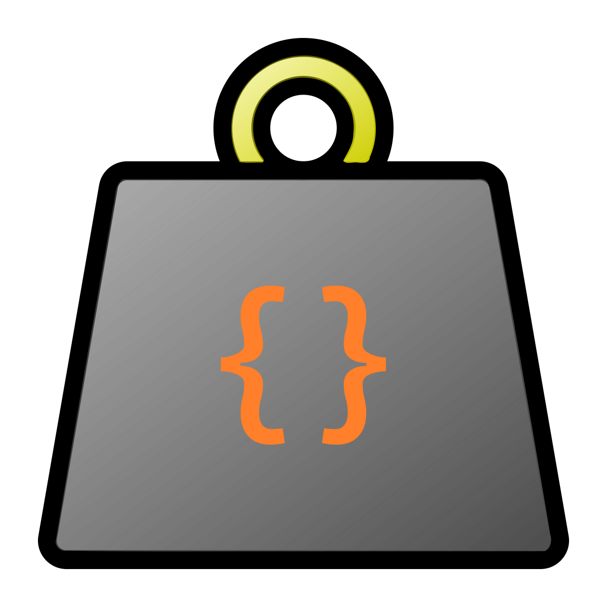

# TON

    

    <strong>
        A human-friendly language for programmatic authoring and safe
        interchange of tree-structured data.
    </strong>

--------------------------------------------------------------------------------

> [!WARNING]
> This is currently in-development vaporware.

**TON** (Tree Object Notation) is a modern data language featuring two dialects:
One for programmatic generation of data, and a static subset for safe data
interchange.

**TON** is designed to be a pleasant and compact replacement for both
[XML](https://www.w3.org/TR/xml) and [JSON](https://www.json.org), combining the
best qualities of each, while allowing advanced users to programmatically
generate large data sets using the full language dialect. At its simplest,
**TON** can be used as a static data format just like XML or JSON, while at its
full potential, it can be used to maintain large and complex textual databases
at a level of maintainability that such data formats simply cannot achieve.

The original motivation for the creation of **TON** was the maintenance of the
sorts of large data sheets that video games often use to describe things like
areas, items, quests, characters, skills, etc. The code dialect should be
well-suited to any similar use case. On the other hand, the data dialect can
is well-suited as a safe and more compact replacement for XML and JSON, e.g. in
networked APIs.

**TON** is an open standard. This project provides both the specification and
the reference implementation in C#.

## Usage

This project offers the following packages:

| Package | Description | Downloads |
| -: | - | :- |
| [![ton][driver-img]][ton-pkg] | Provides the .NET global tool. | ![Downloads][ton-dls] |
| [![Vezel.Ton][core-img]][core-pkg] | Provides the core parsing, analysis, and runtime services. | ![Downloads][core-dls] |
| [![Vezel.Ton.Tooling][tooling-img]][tooling-pkg] | Provides user-facing tooling such as syntax coloring and diagnostic rendering. | ![Downloads][tooling-dls] |
| [![Vezel.Ton.Service][service-img]][service-pkg] | Provides the Language Server Protocol implementation. | ![Downloads][service-dls] |

[driver-pkg]: https://www.nuget.org/packages/ton
[core-pkg]: https://www.nuget.org/packages/Vezel.Ton
[tooling-pkg]: https://www.nuget.org/packages/Vezel.Ton.Tooling
[service-pkg]: https://www.nuget.org/packages/Vezel.Ton.Service

[driver-img]: https://img.shields.io/nuget/v/ton?label=ton
[core-img]: https://img.shields.io/nuget/v/Vezel.Ton?label=Vezel.Ton
[tooling-img]: https://img.shields.io/nuget/v/Vezel.Ton.Tooling?label=Vezel.Ton.Tooling
[service-img]: https://img.shields.io/nuget/v/Vezel.Ton.Service?label=Vezel.Ton.Service

[driver-dls]: https://img.shields.io/nuget/dt/ton?label=
[core-dls]: https://img.shields.io/nuget/dt/Vezel.Ton?label=
[tooling-dls]: https://img.shields.io/nuget/dt/Vezel.Ton.Tooling?label=
[service-dls]: https://img.shields.io/nuget/dt/Vezel.Ton.Service?label=

To install a tool package in a project, run `dotnet tool install <name>`. To
install it globally, also pass `-g`.

To install a library package, run `dotnet add package <name>`.

For more information, please visit the
[project home page](https://docs.vezel.dev/ton).

## Building

You will need the .NET SDK and Node.js installed. Simply run `./cake`
(a [Bash](https://www.gnu.org/software/bash) script) to build artifacts and run
tests. You can also run `./cake pack` to avoid running tests, or `./cake test`
to just build and run tests.

These commands will use the `Debug` configuration by default, which is suitable
for development and debugging. Pass `-c Release` instead to get an optimized
build.

## License

This project is licensed under the terms found in
[`LICENSE-0BSD`](LICENSE-0BSD).
